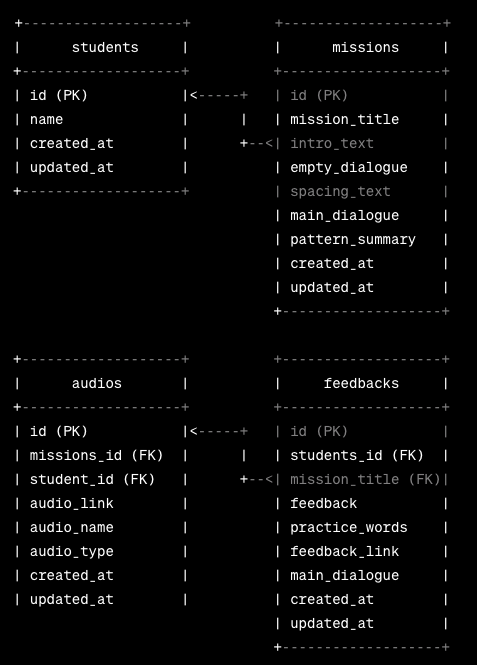

# Imglish

## Overview

Imglish is an innovative language learning platform designed to enhance English proficiency, with a primary focus on pronunciation. Through Imglish, users can access tailored missions aimed at refining their pronunciation skills. The unique feature of the platform lies in its audio submission and feedback system, allowing students to submit their audio recordings for personalized assessments. The app provides constructive feedback in audio format, guiding users on areas for improvement and creating an immersive learning experience.

### Problem

The need for Imglish arose from a recognized gap in language learning resources, particularly in the domain of pronunciation. As conventional resources often lack personalized daily missions and the provision of private audio-based feedback. Imglish addresses this gap by providing a centralized platform where users can receive targeted lessons, engage in daily missions, and receive constructive, individualized audio feedback to refine their pronunciation skills effectively.

### User Profile

#### Target Users:

- For English learners aiming to strengthen and practice their pronunciation to develop a clear and robust base for effective spoken communication.
- For individuals residing in English-speaking countries who wish to revitalize and enhance their language skills.
- Professionals seeking to elevate spoken communication to articulate ideas clearly in workplace interactions.

#### Usage

- Lesson Access: Users can access targeted lessons on pronunciation.
- Daily Missions: Engage in daily missions designed to reinforce and practice pronunciation.
- Audio Submission: Users submit audio recordings for assessment.
- Feedback Reception: Receive individualized audio feedback on submitted recordings.

### Features

#### Information Page

- Display:
  - General information about Imglish.
  - Contact details for inquiries.
  - Introduction to the purpose and unique features of the Imglish app.

#### Daily Missions

- List Daily Missions:
  - Tailored to improve pronunciation.
  - Includes mission titles, descriptions, and audio prompts.

#### Audio Submission

- Allow Users to:
  - Record and submit audio recordings for missions and lessons.

#### Feedback System

- Provide Personalized Audio Feedback:
  - On submitted recordings.
  - Highlights areas for improvement in pronunciation.

## Implementation

### Tech Stack

#### Frontend

- **React Native:** Used for cross-platform mobile app development.
- **React Router:** Handling navigation within the app.
- **Sass:** Stylesheet preprocessor for styling.

#### Backend

- **Node.js (Express):** Handling server-side logic and routing.
- **Knex:** SQL query builder for interfacing with the database.
- **Validator:** Used for email and phone number validation.

#### Database

- **SQL Database:** The database is accessed and manipulated using Knex queries.
- **MySQL (using mysql2):** The database is accessed and manipulated using Knex queries.
- **MySQL Workbench:** Visual tool for database design and management.

#### API Interaction

- **Axios:** Making HTTP requests to interact with the backend API.

#### APIs

- Web Audio API: Handling audio playback, recording, and processing within the app.

### Sitemap

**Main Information Page**

- Provides general information about the Imglish app, its features, and contact details.

**Student Page**

- Main page for students to access daily missions, lessons, submit audio recordings, and receive feedback.
- Components: Mission list, lesson modules, audio submission, feedback display.

### Mockups

### Data

### Endpoints

1. **Imglish Information Endpoint:**

   - GET /api/info
   - Retrieve information about Imglish.

2. **Student Information Endpoint:**

   - GET /api/student/:id
   - Retrieve student information.

3. **Missions Endpoint:**

   - GET /api/student/:id/missions
   - Retrieve a list of missions for a specific student.

4. **Submit Audio for missions Endpoint:**

   - POST /api/student/:id/missionss/:missionsId/submit-audio
   - Submit audio recording for a specific mission.

5. **Feedback Endpoint:**

   - GET /api/student/:id/feedback/:lessonId
   - Retrieve feedback for a specific lesson.

### Auth

Authentication and user profile functionality will be implemented in future versions of the Imglish app. This will include features such as user registration, login, and the ability to create and manage user profiles. The authentication process will be designed to ensure secure access to personalized content, missions, lessons, and feedback.

## Roadmap

### Sprint 1: Project Setup and Imglish Information Page

#### Frontend:

1. Set up a new React Native project.
2. Configure necessary dependencies (React Navigation, Axios, etc.).
3. Design wireframes and layouts for the Imglish information page.

#### Backend:

4. Initialize a new Node.js/Express project for the backend.
5. Install necessary dependencies (Express, Knex, Validator, etc.).
6. Set up your database (MySQL).
7. Create tables or models for student data, missions, lessons, feedback, etc.
8. Implement an endpoint to retrieve general information about Imglish.

### Sprint 2: Student Page Components

#### Frontend:

1. Design wireframes and layouts for the student page.
2. Identify components needed for missions, lessons, feedback, and audio upload.
3. Set up routes and navigation for the student page.
4. Develop and integrate components for missions, lessons, feedback, and audio upload.

#### Backend:

5. Design backend models for missions, lessons, feedback, and student data.
6.

Create routes and controllers for handling student-related data. 7. Implement endpoints for retrieving student data, missions, lessons, and feedback.

### Sprint 3: Backend Integration and Testing

#### Frontend:

1. Modify frontend components to fetch data from the newly implemented backend endpoints.
2. Conduct user testing with a focus on the integrated frontend and backend functionality.

#### Backend:

3. Write unit tests for backend routes and controllers.
4. Conduct user testing with a focus on backend functionality.
5. Gather feedback on the overall user experience and backend data retrieval.
6. Address issues and refine components based on testing.

### Sprint 4: Deployment Preparation and Finalization

#### Frontend:

1. Conduct a final round of testing for both frontend and backend.
2. Ensure data consistency and functionality across the application.
3. Set up deployment environment for the frontend.
   ``

#### Backend:

4. Set up deployment environment for the backend.
5. Prepare for deployment to app stores.
6. Deploy the application to relevant app stores.
7. Verify deployment and address any issues.

## Nice-to-haves

Your project will be marked based on what you committed to in the above document. Under nice-to-haves, you can list any additional features you may complete if you have extra time, or after finishing.

## Nice-to-haves

1. **Teacher Feedback Page:**

   - Implement a dedicated page for teachers to provide feedback on student submissions, creating a collaborative learning environment.

2. **Google Login/Registration:**

   - Integrate Google login/registration for a streamlined and secure user authentication process.

3. **Progress Tracking:**

   - Users can monitor their progress over time, tracking improvements in pronunciation and overall language proficiency through visual representations and performance metrics.

4. **Voice Recognition Technology:**

   - The app utilizes voice recognition technology to assess user pronunciation accuracy, ensuring a dynamic and responsive learning experience.

5. **Subscription Model:**

   - Introduce a subscription model, allowing users to subscribe to receive premium daily missions and lessons.

6. **Offline Mode:**

   - Users can download lessons and missions for offline access, accommodating learners with limited or intermittent internet connectivity.

7. **Community Forums:**

   - A community forum allows users to connect, share experiences, and seek advice, fostering a supportive environment for collaborative learning.

8. **Audio Library:**
   - A curated library of audio samples from native speakers helps users expose themselves to various accents and intonations, enhancing their overall listening and pronunciation skills.

https://codepen.io/sorinbotirla/pen/QyoYgx
